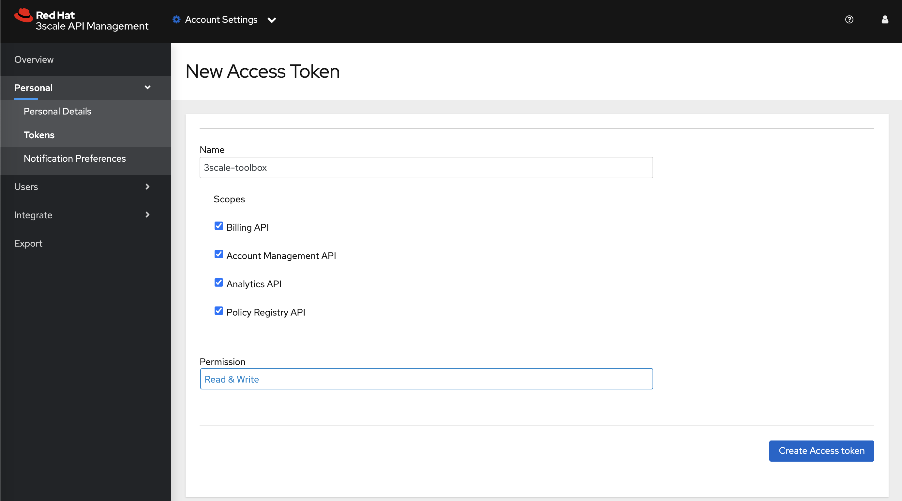
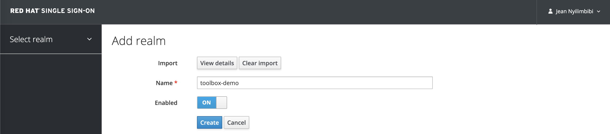
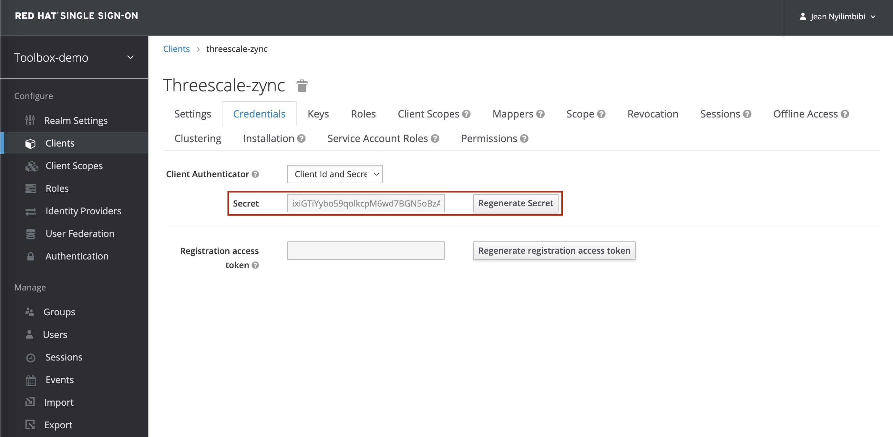
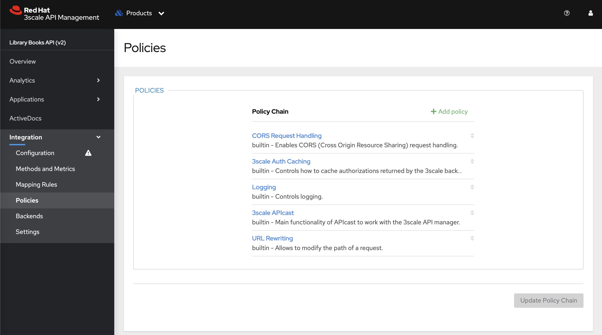
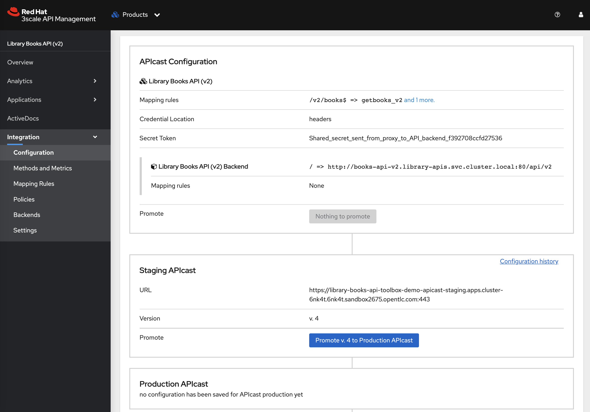
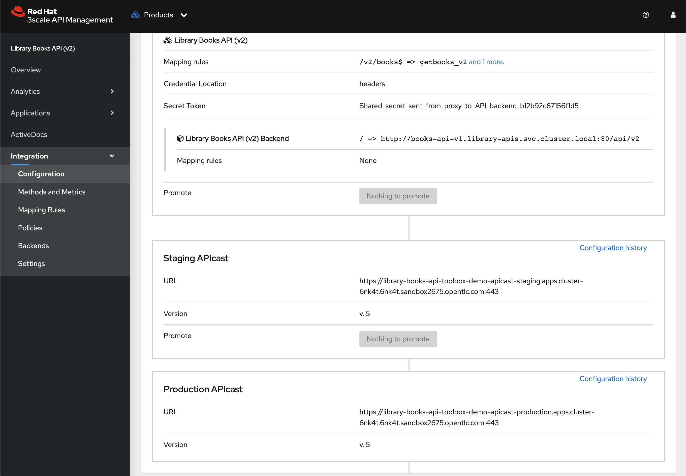

# 3scale-toolbox-demo

## Purpose of this repository

This repository contains demo instructions for setting up and running the [Red Hat 3scale Toolbox CLI](https://access.redhat.com/documentation/en-us/red_hat_THREESCALE_api_management/2.13/html/operating_3scale/the-threescale-toolbox#doc-wrapper) using [podman]([Podman](https://access.redhat.com/documentation/en-us/red_hat_enterprise_linux/9/html/building_running_and_managing_containers/index).


Red Hat 3scale Toolbox **version 2.13.4** is used in these instructions.

## Prerequisites

- [Red Hat OpenShift v4.10+](https://access.redhat.com/products/openshift/) with [Red Hat 3scale v2.13+](https://access.redhat.com/products/red-hat-3scale/) installed
- [Red Hat Single Sign-On v7.6](https://access.redhat.com/products/red-hat-single-sign-on/)
- [Podman v4+](https://access.redhat.com/documentation/en-us/red_hat_enterprise_linux/9/html/building_running_and_managing_containers/index) v4+
    > **NOTE:** [Podman](https://access.redhat.com/documentation/en-us/red_hat_enterprise_linux/9/html/building_running_and_managing_containers/index) must have the credentials to connect to the public Red Hat container registry ([registry.redhat.io](registry.redhat.io)) in order to pull the [3scale Toolbox image](https://catalog.redhat.com/software/containers/3scale-amp2/toolbox-rhel8/60ddc3173a73378722213e7e?container-tabs=gti&gti-tabs=registry-tokens).
    - The `podman login` command can generate a file with credentials (`${XDG_RUNTIME_DIR}/containers/auth.json`). Example: `podman login registry.redhat.io` and then enter the service account credentials to connect.
    - See https://docs.podman.io/en/latest/markdown/podman-login.1.html
    - See https://access.redhat.com/terms-based-registry/ to create the service account associated with your Red Hat customer account.
- Access Token with read-write permissions on all scopes of your Red Hat 3scale API Manager tenant.

    

## Instructions 

### ::bulb:: Notes

The following environment variables are used in the scope of these instructions. Please, do set them according to your Red Hat 3scale environment.

- `ABSOLUTE_BASE_PATH`: absolute path to the working directory where you cloned this repository
- `OCP_DOMAIN`: the application domain of the Red Hat OpenShift cluster hosting the 3scale API Manager.
- `RH_SSO_HOSTNAME`: FQDN of the Red Hat Single Sign-On instance.
- `RH_SSO_THREESCALE_SCALE_ZYNC_SECRET`: secret of the `threescale-zync` client in Red Hat Single Sign-On. This client is used by the remote 3scale API Manager tenant to dynamically register and synchonize the service application credentials.
- `THREESCALE_TENANT`: name of the remote 3scale API Manager tenant
- `THREESCALE_TENANT_ACCESS_TOKEN`: access token with read-write permissions on all scopes of the remote 3scale API Manager tenant.
- `THREESCALE_TENANT_ADMIN_PORTAL_HOSTNAME`: FQDN of the remote 3scale API Manager tenant.
- `THREESCALE_TOOLBOX_DESTINATION`: name of the remote 3scale API Manager tenant registered in the 3scale Toolbox CLI

### 1. Deploy the _Library Books API_ backend services

1. Create the `library-apis` namespace:
    ```
    oc apply -f library-books-api/openshift_manifests/library-apis_namespace.yaml
    ```

2. Deploy the _Library Books API_ service to be secured by 3scale:
    ```
    oc -n library-apis apply -f library-books-api/openshift_manifests/books-api-v2.yaml
    ```

### 2. Setup the 3scale-toolbox CLI

1. Set the following environment variables according to your 3scale environment. Example:
    ```script shell
    THREESCALE_TENANT=toolbox-demo
    THREESCALE_TOOLBOX_DESTINATION=rhpds-toolbox-demo
    OCP_DOMAIN=apps.cluster-6nk4t.6nk4t.sandbox2675.opentlc.com
    THREESCALE_TENANT_ADMIN_PORTAL_HOSTNAME=${THREESCALE_TENANT}-admin.${OCP_DOMAIN}
    ABSOLUTE_BASE_PATH=/home/lab-user
    ```

2. Create a named container that contains the remote 3scale tenant connection credentials.
    ```script shell
    podman run --name 3scale-toolbox-original \
    registry.redhat.io/3scale-amp2/toolbox-rhel8:3scale2.13.4 3scale remote \
    add ${THREESCALE_TOOLBOX_DESTINATION} https://${THREESCALE_TENANT_ACCESS_TOKEN}@${THREESCALE_TENANT_ADMIN_PORTAL_HOSTNAME}
    ```

3. Use `podman commit` to create a new image, `3scale-toolbox-demo`, from the named container. 
    > **NOTE**: Because the previous created container holds the remote information, the new image contains it too.
    ```script shell
    podman commit 3scale-toolbox-original 3scale-toolbox-demo
    ```

4. Create a bash alias to run the [Red Hat 3scale Toolbox CLI](https://access.redhat.com/documentation/en-us/red_hat_THREESCALE_api_management/2.13/html/operating_3scale/the-threescale-toolbox#doc-wrapper) using the `3scale-toolbox-demo` container image.

    > **NOTE**: The `library-books-api` 3scale resources are also mounted into the container at run-time

    ```script shell
    alias 3scale="podman run --rm -v ${ABSOLUTE_BASE_PATH}/3scale-toolbox-demo/library-books-api:/tmp/toolbox/library-books-api:Z 3scale-toolbox-demo 3scale -k"
    ```

### 3. Secure the _Library Books API_ using Red Hat 3scale API Management with OpenID Connect

1. Import the [`toolbox-demo` realm](./rhsso-realm/toolbox-demo_realm-export.json) in your [Red Hat Single Sign-On v7.6](https://access.redhat.com/products/red-hat-single-sign-on/) instance.

    

    > **NOTE**: The `threscale-zync` client is already provisioned in the `toolbox-demo` realm. Please, regenerate the client secret as it will be used in the following instructions.

    

2. Set the following environment variables according to your Red Hat Single Sign-On environment. Example:
    ```script shell
    RH_SSO_HOSTNAME=sso.apps.cluster-6nk4t.6nk4t.sandbox2675.opentlc.com
    RH_SSO_THREESCALE_SCALE_ZYNC_SECRET=ixiGTiYybo59qolkcpM6wd7BGN5oBzAa
    ```

3. Import the _Library Books API_ in 3scale using the OpenAPI specification.

    ```script shell
    3scale import openapi \
    --override-private-base-url="http://books-api-v1.library-apis.svc.cluster.local/api/v2" \
    --oidc-issuer-type=keycloak \
    --oidc-issuer-endpoint="https://threescale-zync:${RH_SSO_THREESCALE_SCALE_ZYNC_SECRET}@${RH_SSO_HOSTNAME}/auth/realms/toolbox-demo" \
    --target_system_name=library-books-api \
    -d ${THREESCALE_TOOLBOX_DESTINATION} /tmp/toolbox/library-books-api/threescale/openapi/LibraryBooksAPI_v2.yaml
    ```

4. Import the application plans.

    **Basic plan**
    ```script shell
    3scale application-plan import \
    --file=/tmp/toolbox/library-books-api/threescale/application_plans/basic-plan.yaml \
    ${THREESCALE_TOOLBOX_DESTINATION} library-books-api
    ```

    **Premium plan**
    ```script shell
    3scale application-plan import \
    --file=/tmp/toolbox/library-books-api/threescale/application_plans/premium-plan.yaml \
    ${THREESCALE_TOOLBOX_DESTINATION} library-books-api
    ```

5. Import the policy chain. 
    ```script shell
    3scale policies import \
    --file=/tmp/toolbox/library-books-api/threescale/policies/policy_chain.yaml \
    ${THREESCALE_TOOLBOX_DESTINATION} library-books-api
    ```
    The following policies will be configured on the _Library Books API product_ in that order:
    - [CORS Request Handling](https://access.redhat.com/documentation/en-us/red_hat_3scale_api_management/2.13/html/administering_the_api_gateway/apicast-policies#cors_standard-policies)
    - [3scale Auth Caching](https://access.redhat.com/documentation/en-us/red_hat_3scale_api_management/2.13/html/administering_the_api_gateway/apicast-policies#threescale-auth-caching_standard-policies)
    - [Logging](https://access.redhat.com/documentation/en-us/red_hat_3scale_api_management/2.13/html/administering_the_api_gateway/apicast-policies#logging_standard-policies)
    - 3scale APIcast (default policy that must note be removed)
    - [URL Rewriting](https://access.redhat.com/documentation/en-us/red_hat_3scale_api_management/2.13/html/administering_the_api_gateway/apicast-policies#url-rewriting_standard-policies)

    

6. Promote the APIcast configuration to the Staging Environment.
    ```script shell
    3scale proxy deploy ${THREESCALE_TOOLBOX_DESTINATION}  library-books-api
    ```

    

7. Create an application with the default Developer account on the Basic plan for testing the configuration.
    ```script shell
    3scale application create \
    --description="Developer's Application to the Library Books API (testing purposes)" \
    ${THREESCALE_TOOLBOX_DESTINATION} john library-books-api basic-plan "Developer's App"
    ```

8. Promote latest staging Proxy Configuration to the production environment
    ```script shell
    3scale proxy-config promote ${THREESCALE_TOOLBOX_DESTINATION} library-books-api
    ```

    