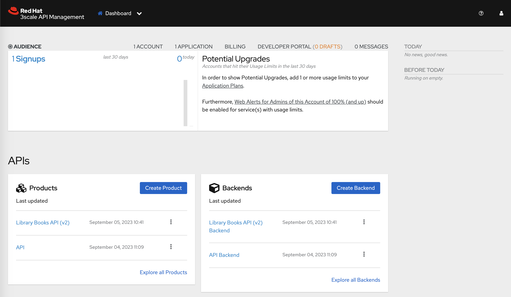
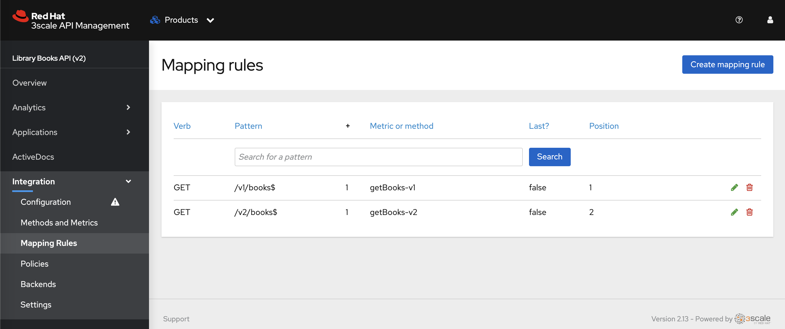
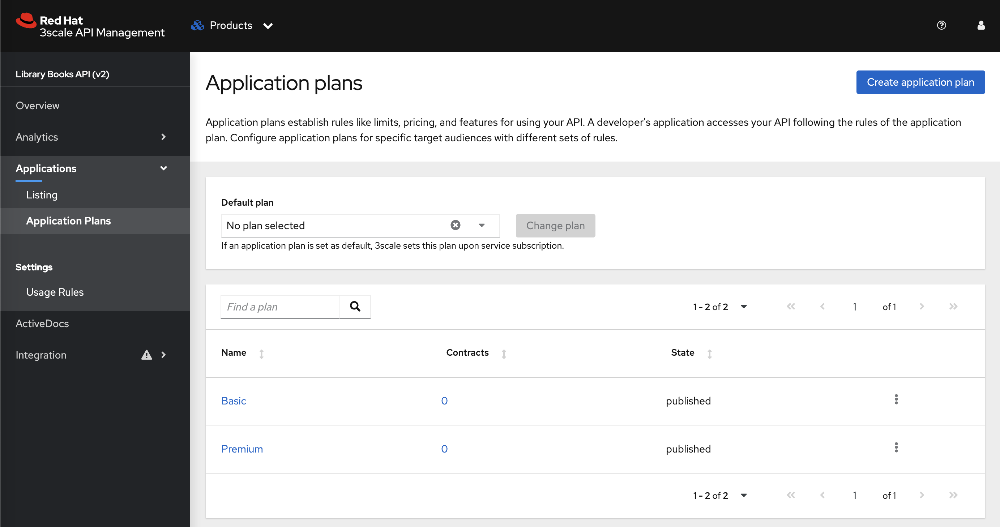
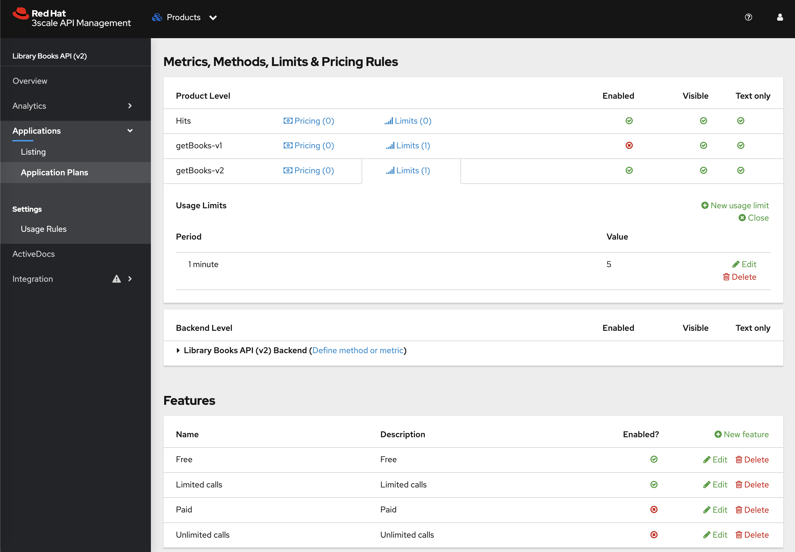
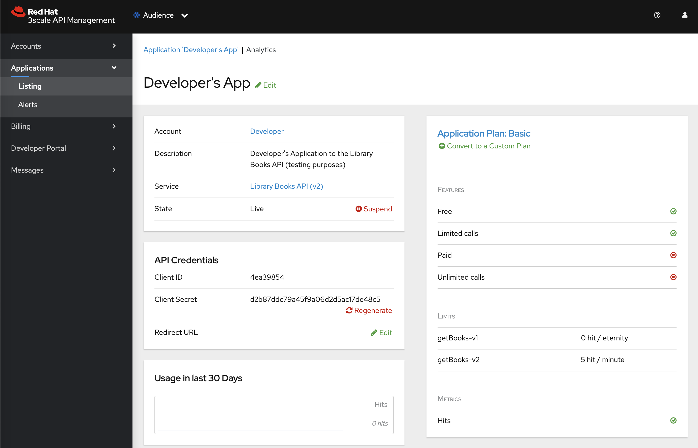
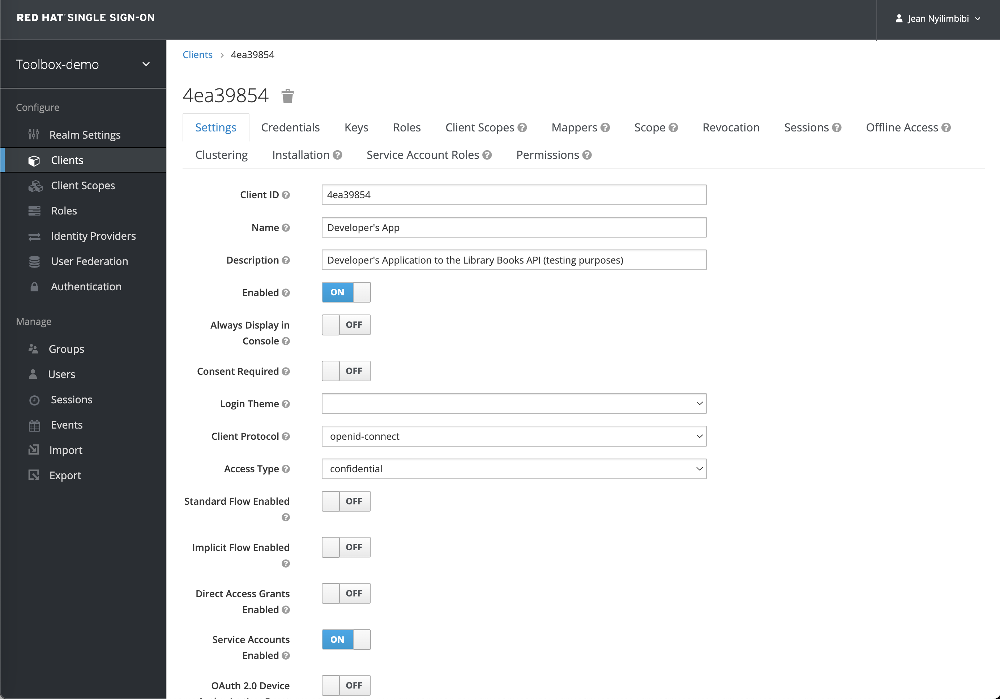

# 3scale-toolbox-demo

## Purpose of this repository

This repository contains demo instructions for setting up and running the [Red Hat 3scale Toolbox CLI](https://access.redhat.com/documentation/en-us/red_hat_THREESCALE_api_management/2.13/html/operating_3scale/the-threescale-toolbox#doc-wrapper) using [Podman](https://access.redhat.com/documentation/en-us/red_hat_enterprise_linux/9/html/building_running_and_managing_containers/index).


Red Hat 3scale Toolbox **v2.13** is used in these instructions.

## Prerequisites

- [Red Hat OpenShift v4.10+](https://access.redhat.com/products/openshift/) with [Red Hat 3scale v2.13+](https://access.redhat.com/products/red-hat-3scale/) installed
- [Red Hat Single Sign-On v7.6](https://access.redhat.com/products/red-hat-single-sign-on/)
- [Podman v4+](https://access.redhat.com/documentation/en-us/red_hat_enterprise_linux/9/html/building_running_and_managing_containers/index) v4+
    > **NOTE:** [Podman](https://access.redhat.com/documentation/en-us/red_hat_enterprise_linux/9/html/building_running_and_managing_containers/index) must have the credentials to connect to the public Red Hat container registry ([registry.redhat.io](registry.redhat.io)) in order to pull the [3scale Toolbox image](https://catalog.redhat.com/software/containers/3scale-amp2/toolbox-rhel8/60ddc3173a73378722213e7e?container-tabs=gti&gti-tabs=registry-tokens).
    - The `podman login` command can generate a file with credentials (`${XDG_RUNTIME_DIR}/containers/auth.json`). Example: `podman login registry.redhat.io` and then enter the service account credentials to connect.
    - See https://docs.podman.io/en/latest/markdown/podman-login.1.html
    - See https://access.redhat.com/terms-based-registry/ to create the service account associated with your Red Hat customer account.
- Access Token with read-write permissions on all scopes of your Red Hat 3scale API Manager tenant.

    

## Instructions 

### :bulb: Notes

The following environment variables are used in the scope of these instructions. Please, do set them according to your Red Hat 3scale environment.

- `ABSOLUTE_BASE_PATH`: absolute path to the working directory where you cloned this repository
- `OCP_DOMAIN`: the application domain of the Red Hat OpenShift cluster hosting the 3scale API Manager.
- `RH_SSO_HOSTNAME`: FQDN of the Red Hat Single Sign-On instance.
- `RH_SSO_THREESCALE_ZYNC_SECRET`: secret of the `threescale-zync` client in Red Hat Single Sign-On. This client is used by the remote 3scale API Manager tenant to dynamically register and synchonize the service application credentials.
- `THREESCALE_TENANT`: name of the remote 3scale API Manager tenant
- `THREESCALE_TENANT_ACCESS_TOKEN`: access token with read-write permissions on all scopes of the remote 3scale API Manager tenant.
- `THREESCALE_TENANT_ADMIN_PORTAL_HOSTNAME`: FQDN of the remote 3scale API Manager tenant.
- `THREESCALE_TOOLBOX_DESTINATION`: name of the remote 3scale API Manager tenant registered in the 3scale Toolbox CLI

### I. Deploy the _Library Books API_ backend services

1. Create the `library-apis` namespace:
    ```
    oc apply -f library-books-api/openshift_manifests/library-apis_namespace.yaml
    ```

2. Deploy the _Library Books API_ service to be secured by 3scale:
    ```
    oc -n library-apis apply -f library-books-api/openshift_manifests/books-api-v2.yaml
    ```

### II. Setup the 3scale-toolbox CLI

1. Set the following environment variables according to your 3scale environment. Example:
    ```script shell
    export ABSOLUTE_BASE_PATH=/home/lab-user
    export OCP_DOMAIN=apps.cluster-8bcs7.8bcs7.sandbox2056.opentlc.com
    export THREESCALE_TENANT=toolbox-demo
    export THREESCALE_TENANT_ACCESS_TOKEN=d933768edd510543ed7088b60bc2576bc277b430a2f275be0de28e3ad7509f09
    export THREESCALE_TENANT_ADMIN_PORTAL_HOSTNAME=${THREESCALE_TENANT}-admin.${OCP_DOMAIN}
    export THREESCALE_TOOLBOX_DESTINATION=rhpds-toolbox-demo
    ```

2. Create a named container that contains the remote 3scale tenant connection credentials.
    ```script shell
    podman run --name 3scale-toolbox-original \
    registry.redhat.io/3scale-amp2/toolbox-rhel8:3scale2.13 3scale remote \
    add ${THREESCALE_TOOLBOX_DESTINATION} https://${THREESCALE_TENANT_ACCESS_TOKEN}@${THREESCALE_TENANT_ADMIN_PORTAL_HOSTNAME}
    ```

3. Use `podman commit` to create a new image, `3scale-toolbox-demo`, from the named container. 
    > **NOTE**: Because the previous created container holds the remote information, the new image contains it too.
    ```script shell
    podman commit 3scale-toolbox-original 3scale-toolbox-demo
    ```

4. Create a bash alias to run the [Red Hat 3scale Toolbox CLI](https://access.redhat.com/documentation/en-us/red_hat_THREESCALE_api_management/2.13/html/operating_3scale/the-threescale-toolbox#doc-wrapper) using the `3scale-toolbox-demo` container image.

    > **NOTE**: The `library-books-api` 3scale resources are also mounted into the container at run-time

    ```script shell
    alias 3scale="podman run --rm -v ${ABSOLUTE_BASE_PATH}/3scale-toolbox-demo/library-books-api:/tmp/toolbox/library-books-api:Z 3scale-toolbox-demo 3scale -k"
    ```

### III. Secure the _Library Books API_ using Red Hat 3scale API Management with OpenID Connect

1. Import the [`toolbox-demo` realm](./rhsso-realm/toolbox-demo_realm-export.json) in your [Red Hat Single Sign-On v7.6](https://access.redhat.com/products/red-hat-single-sign-on/) instance.

    

    > **NOTE**: The `threscale-zync` client is already provisioned in the `toolbox-demo` realm. Regenerate the client secret as it will be used in the following instructions.

    

2. Set the following environment variables according to your Red Hat Single Sign-On environment. Example:
    ```script shell
    export RH_SSO_HOSTNAME=sso.apps.cluster-8bcs7.8bcs7.sandbox2056.opentlc.com
    export RH_SSO_THREESCALE_ZYNC_SECRET=ixiGTiYybo59qolkcpM6wd7BGN5oBzAa
    ```

3. Import the _Library Books API_ in 3scale using its OpenAPI specification.

    ```script shell
    3scale import openapi \
    --override-private-base-url="http://books-api-v2.library-apis.svc.cluster.local/api/v2" \
    --oidc-issuer-type=keycloak \
    --oidc-issuer-endpoint="https://threescale-zync:${RH_SSO_THREESCALE_ZYNC_SECRET}@${RH_SSO_HOSTNAME}/auth/realms/toolbox-demo" \
    --target_system_name=library-books-api \
    -d ${THREESCALE_TOOLBOX_DESTINATION} /tmp/toolbox/library-books-api/threescale/openapi/LibraryBooksAPI_v2.yaml
    ```

    After importing, you should find the _Library Books API_ product and backend objects on the 3scale Admin Portal dashboard.

    

    You can drill down into the details of each object to verify all the configurations that have been automatically applied based on the OpenAPI specification. For instance, the 3scale API product mapping rules.

    

4. Import the application plans.

    - Basic plan 
        ```script shell
        3scale application-plan import \
        --file=/tmp/toolbox/library-books-api/threescale/application_plans/basic-plan.yaml \
        ${THREESCALE_TOOLBOX_DESTINATION} library-books-api
        ```

    - Premium plan
        ```script shell
        3scale application-plan import \
        --file=/tmp/toolbox/library-books-api/threescale/application_plans/premium-plan.yaml \
        ${THREESCALE_TOOLBOX_DESTINATION} library-books-api
        ```

    After importing, you should find the `Basic` and `Premium` plans on the _Library Books API_ product page of the 3scale Admin Portal.

    

    You can drill down into the details of each application plan to verify the configurations that has been applied. For instance, the details of the `Basic` are shown below.

    

5. Import the policy chain. 
    ```script shell
    3scale policies import \
    --file=/tmp/toolbox/library-books-api/threescale/policies/policy_chain.yaml \
    ${THREESCALE_TOOLBOX_DESTINATION} library-books-api
    ```
    The following policies will be configured on the _Library Books API product_ in that order:
    - [CORS Request Handling](https://access.redhat.com/documentation/en-us/red_hat_3scale_api_management/2.13/html/administering_the_api_gateway/apicast-policies#cors_standard-policies)
    - [3scale Auth Caching](https://access.redhat.com/documentation/en-us/red_hat_3scale_api_management/2.13/html/administering_the_api_gateway/apicast-policies#threescale-auth-caching_standard-policies)
    - [Logging](https://access.redhat.com/documentation/en-us/red_hat_3scale_api_management/2.13/html/administering_the_api_gateway/apicast-policies#logging_standard-policies)
    - 3scale APIcast (default policy that must note be removed)
    - [URL Rewriting](https://access.redhat.com/documentation/en-us/red_hat_3scale_api_management/2.13/html/administering_the_api_gateway/apicast-policies#url-rewriting_standard-policies)

    

6. Promote the APIcast configuration to the Staging Environment.
    ```script shell
    3scale proxy deploy ${THREESCALE_TOOLBOX_DESTINATION} library-books-api
    ```

    

7. Create an application with the default Developer account subscribing to the service Basic plan in order to test the configuration.
    ```script shell
    3scale application create \
    --description="Developer's Application to the Library Books API (testing purposes)" \
    ${THREESCALE_TOOLBOX_DESTINATION} john library-books-api basic-plan "Developer's App"
    ```

    - `Developer's App` application credentials in 3scale:

        

    - `Developer's App` application credentials are dynamically synchronized in Red Hat Single Sign-On:

        

8. Perform some testing of your configuration in the 3scale staging environment.

    1. Get the OpenID Connect access token from your Red Hat Single Sign-On instance. Example using [httpie](https://httpie.io/) and [jq](https://jqlang.github.io/jq/):

        > **NOTE**: replace `client_id` and `client_secret` values with your 3scale application credentials
        ```script shell
        TOKEN=$(http --form POST \
        https://${RH_SSO_HOSTNAME}/auth/realms/toolbox-demo/protocol/openid-connect/token \
        grant_type="client_credentials" \
        client_id="c2fcdaf0" \
        client_secret="91d58f193e0361e1dfd464cd22d9e914" \
        scope="openid" | jq -r .access_token) \
        && echo $TOKEN
        ```

    2. Test the forbidden `/v1/books` path 

        > **NOTE**: Adjust the 3scale _Staging Public Base URL_ according to your environment.
        ```script shell
        http https://library-books-api-toolbox-demo-apicast-staging.${OCP_DOMAIN}/v1/books "Authorization: Bearer ${TOKEN}"
        ```

        The 3scale API gateway should reject the request.
        ```console
        HTTP/1.1 403 Forbidden
        Set-Cookie: 53778cee9e38d74175ba9f9b935fafa3=029543885803175ab074c39d7f68f2a1; path=/; HttpOnly; Secure; SameSite=None
        content-type: text/plain; charset=us-ascii
        date: Wed, 06 Sep 2023 08:35:58 GMT
        server: openresty
        set-cookie: 53778cee9e38d74175ba9f9b935fafa3=029543885803175ab074c39d7f68f2a1; path=/; HttpOnly; Secure; SameSite=None
        transfer-encoding: chunked

        Authentication failed
        ```

    3. Test the authorized `/v2/books` path

        > **NOTE**: Adjust the 3scale _Staging Public Base URL_ according to your environment.
        ```script shell
        http https://library-books-api-toolbox-demo-apicast-staging.${OCP_DOMAIN}/v2/books "Authorization: Bearer ${TOKEN}"
        ```

        The 3scale API gateway should authorize the request.
        ```console
        HTTP/1.1 200 OK
        Set-Cookie: 53778cee9e38d74175ba9f9b935fafa3=029543885803175ab074c39d7f68f2a1; path=/; HttpOnly; Secure; SameSite=None
        cache-control: private
        content-length: 380
        content-type: application/json; charset=utf-8
        date: Wed, 06 Sep 2023 08:36:30 GMT
        etag: W/"17c-mAOxgNf23v8UFtVUQAqCm0SsCUA"
        server: openresty
        set-cookie: 53778cee9e38d74175ba9f9b935fafa3=029543885803175ab074c39d7f68f2a1; path=/; HttpOnly; Secure; SameSite=None
        x-powered-by: Express

        [
            {
                "author": {
                    "birthDate": "1797-08-30T00:00:00.000Z",
                    "name": "Mary Shelley"
                },
                "copies": 10,
                "title": "Frankenstein",
                "year": 1818
            },
            {
                "author": {
                    "birthDate": "1812-02-07T00:00:00.000Z",
                    "name": "Charles Dickens"
                },
                "copies": 5,
                "title": "A Christmas Carol",
                "year": 1843
            },
            {
                "author": {
                    "birthDate": "1775-12-16T00:00:00.000Z",
                    "name": "Charles Dickens"
                },
                "copies": 3,
                "title": "Pride and Prejudice",
                "year": 1813
            }
        ]
        ```

    4. Test rate limit (5 calls/mn). After 5 consecutive requests, the 3scale API gateway should reject your call.

        > **NOTE**: Adjust the 3scale _Staging Public Base URL_ according to your environment.
        ```script shell
        http https://library-books-api-toolbox-demo-apicast-staging.${OCP_DOMAIN}/v2/books "Authorization: Bearer ${TOKEN}"
        ```

        The 3scale API gateway should reject the request.
        ```console
        HTTP/1.1 429 Too Many Requests
        Set-Cookie: 53778cee9e38d74175ba9f9b935fafa3=029543885803175ab074c39d7f68f2a1; path=/; HttpOnly; Secure; SameSite=None
        content-type: text/plain; charset=us-ascii
        date: Wed, 06 Sep 2023 08:37:57 GMT
        retry-after: 3
        server: openresty
        set-cookie: 53778cee9e38d74175ba9f9b935fafa3=029543885803175ab074c39d7f68f2a1; path=/; HttpOnly; Secure; SameSite=None
        transfer-encoding: chunked

        Usage limit exceeded
        ```

9. After performing some tests of your configuration in the 3scale staging environment, you can now promote the latest staging Proxy Configuration to the 3scale production environment.
    ```script shell
    3scale proxy-config promote ${THREESCALE_TOOLBOX_DESTINATION} library-books-api
    ```

    